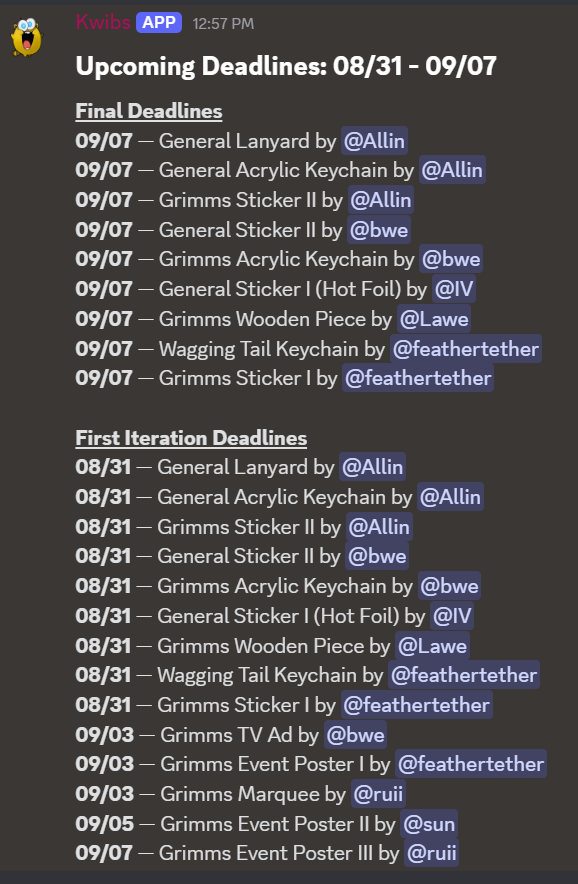

# Notion and Discord Integration

This project pulls data from a Notion database to send weekly reminders summarizing upcoming deadlines in Discord.

Originally written for the Art Team at the Keyboard Club @ UCSD. Each assignment has two dates associated with it, a "final due date" and a "first iteration due date," which is one week before the final due date. These values are tracked in Notion, and this project pulls all of the Notion data, filters for due dates and first iteration dates within the next week, and then sends a summarized message in a Discord channel.

This project also uses Github Actions to automate sending messages every week on Saturdays at 12:00AM PST.

Other team usage (including Team Leads for Keyboard Club) is stored in their respective branches with their own message configuration, timing, and pipelines.

## Setup and Installation
Clone this repository and run `npm install` to install all of the dependencies for the project.

Create an app in Discord's developer portal by following the instructions [here](https://discord.com/developers/docs/quick-start/getting-started#step-1-creating-an-app). Alternatively, you can use an existing app and its existing credentials.

Create a Notion integration by following the instructions [here](https://developers.notion.com/docs/create-a-notion-integration#create-your-integration-in-notion).

Rename `sample.env` to `.env` and fill in the fields as follows:

Details for Discord credentials can be found on [Discord's developer site](https://discord.com/developers/docs/quick-start/getting-started#fetching-your-credentials).
- `DISCORD_APP_ID`: The Application ID value
- `DISCORD_PUBLIC_KEY`: The Public Key value
- `DISCORD_BOT_TOKEN`: The bot token value
- `DISCORD_CHANNEL_ID`: Found by right-clicking on the channel you want to send message in and clicking "Copy Channel ID"

Details for Notion credentials can be found on [Notion's developer site](https://developers.notion.com/docs/create-a-notion-integration#environment-variables).
- `NOTION_KEY`: The API secret key
- `NOTION_PAGE_ID`: The page ID of the Notion database

This project uses a JSON map to map Notion IDs to Discord IDs in order to ping the correct person in Discord based on the assignee in Notion. This is formatted as
```
NOTION_TO_DISCORD_MAP: '{
    "<notion-user-id>": "<discord-user-id>",
    ...
}'
```
inside the `.env` file.

Notion user IDs can be found using by using the [Notion API](https://developers.notion.com/reference/get-users). An alternative is to create a temporary database, assign each user to a separate page using an "Assignee" field, and add a formula property with the formula `id(Assignee.first())`. Details can be found [here](https://www.reddit.com/r/Notion/comments/wuus7m/comment/m0pj5ut/).

Discord user IDs can be found by right-clicking on the specified user and pressing "Copy User ID."

## Usage

Run `node app.js`. This will send a formatted message in the specified Discord channel. The app will immediately exit once the message is sent.

The current message format is as follows:
```
Upcoming Deadlines: [date range]

Final Deadlines
[Date] - [Assignment Name] by [User]

First Iteration Deadlines
[Date] - [Assignment Name] by [User]
```


## Automation

This script uses multiple environments to store different environment variables that are specific to each team. For example, the Team Leads reminders use a different Notion database and sends to a different Discord channel.

To set up automation, do the following:

1. [Create a Github Environment](https://docs.github.com/en/actions/how-tos/deploy/configure-and-manage-deployments/manage-environments#creating-an-environment) for each database you plan to pull from, channe to send to, etc. (any other unique identifiers used to separate the workflow runs).

2. Place all shared variables inside repository secrets (usually `DISCORD_APP_ID`, `DISCORD_BOT_TOKEN`, `DISCORD_PUBLIC_KEY`, `NOTION_KEY`) and all unique variables (usually `DISCORD_CHANNEL_ID`, `NOTION_PAGE_ID`, `NOTION_TO_DISCORD_MAP`) inside environment secrets.

3. Update the `node.js.yml` file to use your specified environment.